# Machine Learning Engineer Nanodegree

## Transfer learning: comparison of VGG16, Resnet and Inception networks performance for image recognition
Luis Gabriel Rezzonico

April 1st, 2017

## I. Definition


### Project Overview

Transfer learning is the improvement of learning in a new task through the transfer of knowledge from a task that has already been learned.

We can see the concept of transfer learning in the real world, when a person tries to learn a new task, that person is going to use previously acquired concept to accelerate the process of learning. Learning to play the guitar is going to be a relatively easier task for a person who has an extensive experience playing music.

Most of the time, obtaining training data is an expensive task, this is one of the reasons to use Transfer Learning of a big previously acquired dataset [1] to a new task. Transfer Learning becomes increasingly important if we take into consideration that the "state-of-the-art" models are trained for months using high performance computers. [2] [3]

Image recognition is the task of determining whether or not a image contains a specific object or not. There has been a boom of startups using this technology to solve real life problems. [4] Currently the best algorithms to solve the task are Convolutional Neural Networks [1]. 

This capstone aims to provide a comparison of the performance of several pre-trained models for the task of image recognition. Can transfer learning be applied to an image recognition task? The findings of this capstone would be invaluable for people who either do not have the monetary resources or the time to train a model from scratch.

As I started to compete on kaggle competitions, I was wondering if it would be better to train my own models from scratch on each competition's dataset or re-train one of the models trained on a big dataset like ImageNet. This capstone aims to answer this question. It is going to be show that re-training achieves better results. 

The dataset to be used contains 25,000 images of dogs and cats and can be obtained in the Kaggle's Competition site: https://www.kaggle.com/c/dogs-vs-cats-redux-kernels-edition/data.

This capstone also use the "weights" (knowledge) of the pretrained models on the ImageNet dataset, these weights files are listed below:

* VGG: https://goo.gl/go2y7h
* Resnet50: https://goo.gl/MuftHu
* Inverption V3: https://goo.gl/R0Ig5B


### Problem Statement

The objective of this capstone is to compare the accuracy obtained by state-of-the-art Convolutional Neural Networks using the technique know as transfer of learning. The pretrained convolutional neural networks to be used are VGG16, Reasnet50 and Inception V3. All this models has been trained with the ImageNet dataset[1] . These networks are going to be applied to solve the Kaggle's Dogs vs. Cats competition. A small CNN trained directly on the Cats and Dogs dataset is going to be used as a becnhmark.

The aim of the capstone is to give a comparison of the performance obtained by the pre trained models on the dataset of Cats and Dogs. As a new kaggle competitor, people ask themselves if it is better to train their own models or to re-train a previously trained model. 

Although transfer of learning has been addressed by several papers: [https://arxiv.org/pdf/1411.1792v1.pdf], [https://arxiv.org/pdf/1403.6382.pdf] and [https://arxiv.org/pdf/1310.1531.pdf], this capstone has a more practical approach. Is going to be shown experimentally that in general is better to re-train a previously trained model, taking advantage of the features already learned by the model.


### Metrics


The evaluation metric is going to be the one used in the kaggle's competition "Cats and Dogs" (the one used for the input dataset), a logaritmic loss function. This can be calculated with the following formula:


$$LogLoss = - \frac {1}{n}\sum_{i=1}^{n} [y_i log(p_i) + (1-y_i) log(1-p_i)]$$

where

n is the number of images in the test set

pi is the predicted probability of the image being a dog

yi is 1 if the image is a dog, 0 if cat

log() is the natural (base e) logarithm

In order to calculate the logaritmic loss, the classifier implemented has assign a probabilty to each predicted class, in contrast to just yielding the predicted class.

This metric was chosen because it penalizes incorrect predictions and because it is the one used in the compotition from which the dataset was obteined.


## II. Analysis


### Data Exploration

All the code used to obtained the metrics showed in this section can be found in the following link: https://goo.gl/pXMz8K.

There are 25000 images in the dataset. Figure 1 shows that there are the same number of cats an dogs in the dataset. This means that there is not going to be any problem related with imbalanced data.

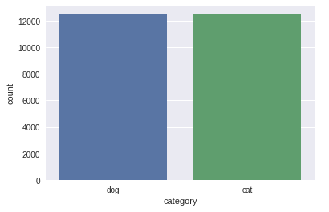

The train directory consist of labelled data with the following convention for each image:
data/train/CLASS.id.jpg. The class of each image is given in the file name. In this capstone  keras.preprocessing.image library is going to be used, to do so, we need the folder structure to be:
data/train/CLASS/image-name.jpg. Figure 2 shows some metadata of the five first entries of the dataset, we can see the filename convention and each class.

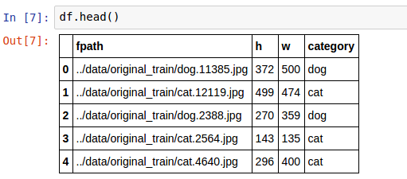

 Figure 3 and Figure 4 gives some metrics of the image file size. We can see that the mean size of the images is (360.478080,404.09904). Image width values are concentrated around 500 pixels and the height around 380 pixels. There are only two outliers with heigher resolution than the rest of the images. The smallest height is 32 pixels and the smallest width is 42 pizels. 

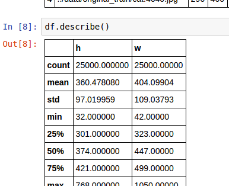

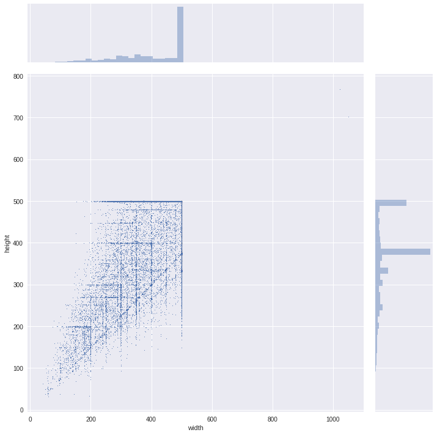


Figure 5 and Figure 6 show a sample of the images to be used in the capstone, this is useful to know whith what we are going to be dealing.

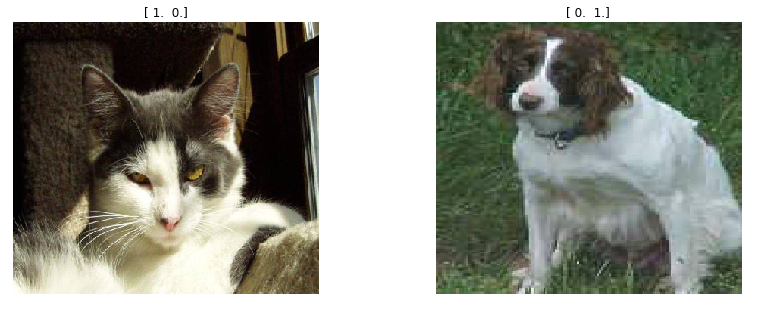

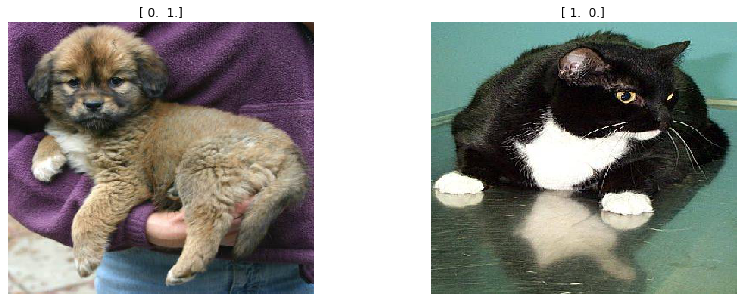

The are no major anormalities beside the stadistics shown in this section, one thing to mention is that there are some images that contain some other object besides cats and dogs, an example can be shown in Figure 7.

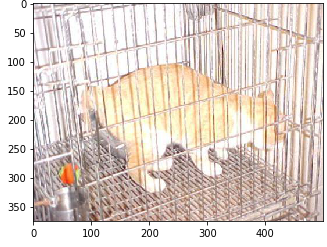


### Algorithms and Techniques

Artificial neural network are used heavily in this capstone, these networks are a computational model based originally in the human brain. A neural network is an interconection of neurons. Each Neuron is a computation unit that receives an input, aplies a weight, bias and an activation function, producing an output:

$$ output = f(w1 . X1 + b) $$

where f is the activation function, X1 is the input, w1 is the weight and b is the bias.

In an Neural network all the neurons from one layer are connected with all the neurons from the next layer. To get a better understanding of this concept, this is a useful resource [7]

Convolutional neural networks are the main topic of this capstone. CNN are a type of artificail neural network that take advantage of assuming that the input is an image. Each neuron in a layer of a CNN is only connected to a region of the input. This way the number of weights that each layer manage is smaller than the ones from a Neural Network. CNN are mainly compose of two types of operation: Convolution and Pooling. On top of CNN Fully Connected Neuwork are used, these are Neural networks.

To conduct transfer learning (this is, to use the knowledge already learnet by the network using other dataset) the pre-trained weights of three models where used. This three models are InceptionV3, ResNet50 and Vgg16. Although we are not going to enter in detail, this models have several layers of convolution and pooling (and several other operations) with different network's architecture, a reference explication is given below:

* VGG16

This model created in 2014, obtained an error rate of 7.3% on the ILSVRC 2014 competition. This convolutional neural network has 16 layers, it uses 3x3 convulutional layers with a max pooling of 2x2. It uses RELU as activation function. [8]

* InceptionV3 

This deep convolutional neural network was developed by Google. The most important layer of this network is called Inception. The inception module allows the network to compute operation in parallel, there are several paths in each inception module with different operations. The model itself can learn wich path its better when training. [2]


* ResNet50 

This convolutional neural network was invented by Microsoft. It has 152 layers. The main idea of this network is a block called Residual Block. This block has two convolutional operations, like any other CNN but the difference is that it adds the input to the block to the output. [3]


The "weights" (knowledge) of the models used in this capstone, where pretrained on the ImageNet dataset, the weights files used are listed below:

* VGG: https://goo.gl/go2y7h
* Resnet50: https://goo.gl/MuftHu
* Inverption V3: https://goo.gl/R0Ig5B

A CNN completely trained on the Dogs and Cats dataset was used. The architecture of the network can be seen in Figure 8.

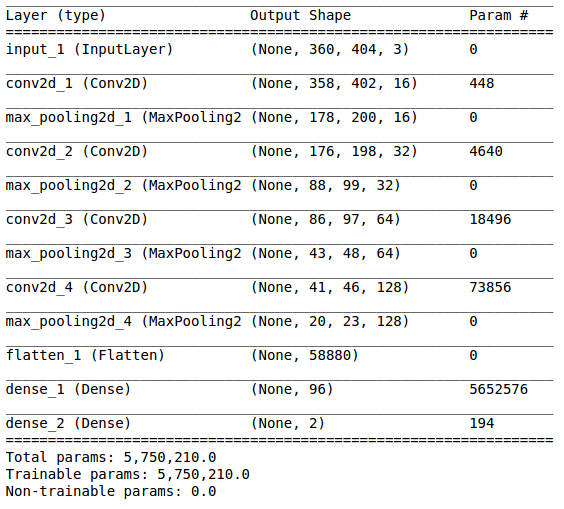


### Benchmark

The benchmark used was the results of the logaritmic loss obtained by the CNN trained from scratch on the data set of Cats and Dogs. The CNN arquitecture used can be seen in figure 9. More information about the metric calculation can be obtained in the subsection "Metrics" of section 1.

The results obtained using the benchmark CNN are the following:

|   | LogLoss  | Accuracy  |
|---|---|---|
| Benchmark CNN  | 0.17  | 0.87  |

To have a reference point in the confusion matrix given of the other models, the confusion matrix of this model is given below:

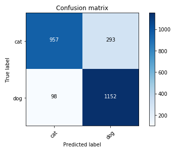


## III. Methodology


### Data Preprocessing

The dataset consist of labelled data with the following convention for each image:
```
data/train/CLASS.id.jpg
```
 The class of each image is given in the file name. In this capstone  keras.preprocessing.image library is going to be used, to do so, we need the folder structure to be:
```
data/train/CLASS/image-name.jpg.
```

An script was written to convert between the two formats. It can be found in the repository of the project.

There was not need to preprocess the images of the dataset. The only preprocessing tecnique applied to the images was normaliztion, each value of each RGB image was divided by 255.

The tecnique of data augmentation was also used during the training step. During this step of data augmentation, the tecniques used where to flip the images horizontally. Shear and zoom with an angle of 0.2 radians was also used.


### Process

The process used to transfer the learned features of the CNN to the new domain is the same for every pre-trained CNN. The main steps are explained bellow:

1. Create the model's network architecture and load the weight file. In this step we are not going to create the "classification" head of the original network, only the CNN layers are created. All these layers are set to be NON trainable.

2. On top of the network created in the step one, a small Fully Connected Network was connected with the objective to classified the images. 

3. We feed our complete network with the images from the Cats and Dogs data set. The CNN uses its weights to computed pre-learned useful features. The FCN receives these "features" computed by the pre-trained CNN and try to use this features to predict iamge in the new domain.

We repeat these process by several epochs.

4. Once we have our FCN classifier fully trained, we set the last layers of the CNN to be "trainable". Set the learning rate to a lower value and feed the complete network. This way we slightly modify the weights of the last layers of the CNN to be tuned with the new dataset.


### Implementation

All the implementation was done using the keras labrary with tensorflow as a backend.

The implementation of the convolutional neural network used to obtain the benchmark is documented in the following code snippet:

```python
inputs = Input(shape = (IMAGE_SIZE[0], IMAGE_SIZE[1], 3))

# First CNN Layer
x = Convolution2D(16, (3, 3), 
                  activation='relu', 
                  data_format="channels_last", 
                  kernel_initializer="he_uniform")(inputs)

x = MaxPooling2D(pool_size=(3, 3), 
                 strides=(2, 2), 
                 data_format="channels_last")(x)

# Second CNN Layer
x = Convolution2D(32, (3, 3), 
                  activation='relu', 
                  data_format="channels_last", 
                  kernel_initializer="he_uniform")(x)
x = MaxPooling2D(pool_size=(2, 2), 
                 strides=(2, 2), 
                 data_format="channels_last")(x)

# Third CNN Layer
x = Convolution2D(64, (3, 3), 
                  activation='relu', 
                  data_format="channels_last", 
                  kernel_initializer="he_uniform")(x)
x = MaxPooling2D(pool_size=(2, 2), 
                 strides=(2, 2), 
                 data_format="channels_last")(x)

# 4 CNN Layer
x = Convolution2D(128, (3, 3), 
                  activation='relu', 
                  data_format="channels_last", 
                  kernel_initializer="he_uniform")(x)
x = MaxPooling2D(pool_size=(2, 2), 
                 strides=(2, 2), 
                 data_format="channels_last")(x)


x = Flatten()(x)

x = Dense(96, activation='relu',kernel_initializer="he_uniform")(x)
predictions = Dense(2, activation='softmax')(x)
```

The creation and load of weights of the InceptionV3 model can be seen bellow:

```python
from keras.applications.inception_v3 import InceptionV3
# create the base pre-trained model
base_model = InceptionV3(weights='imagenet', include_top=False)
```

The creation and load of weights of the ResNet50 model can be seen bellow:

```python
from keras.applications.resnet50 import ResNet50
# create the base pre-trained model
base_model = ResNet50(weights='imagenet', include_top=False)
```

The creation and load of weights of the VGG16 model can be seen bellow:

```python
from keras.applications.vgg16 import VGG16
# create the base pre-trained model
base_model = VGG16(weights='imagenet', include_top=False)
```

On top of each of the pre-trained convolutional networks a simple FCN was used as a classifier:

```python
###########
# FCN layer
###########
from keras.layers import Dense, Dropout, GlobalAveragePooling2D
# add a global spatial average pooling layer
x = base_model.output
x = GlobalAveragePooling2D()(x)
# let's add a fully-connected layer
x = Dense(64, activation='relu')(x)
x = Dropout(0.3)(x)
# and a logistic layer 
predictions = Dense(2, activation='softmax')(x)
```

Adding this FCN on top of each of the base models (the one already pre-trained) we obtain each network used in the capstone, the snippet of code below shows how this is done:

```python
###########
# complete model
###########
from keras.models import Model
# this is the model we will train
model = Model(inputs=base_model.input, outputs=predictions)
```


Stochastic Gradient descent was used as an optimizer to train all the network, a snippet of code show how it was configured:

```python
OPTIMIZER_LEARNING_RATE = 1e-2
OPTIMIZER_DECAY = 1e-4
OPTIMIZER_MOMENTUM = 0.89
OPTIMIZER_NESTEROV_ENABLED = False
from keras.optimizers import SGD
optimizer = SGD(lr=OPTIMIZER_LEARNING_RATE, 
          decay=OPTIMIZER_DECAY, 
          momentum=OPTIMIZER_MOMENTUM, 
          nesterov=OPTIMIZER_NESTEROV_ENABLED)
```

This learning rate was selected empirically. The learning rate was decresed for the fine-tuning step. 

The models are really complex (mainly because of the use of pre-trained models) and are really deep, this make the model prone to overfitting. To combat this problem a Dropout layer was used. The parameter of the dropout was selected empirically. First, dropout values of 0.9, 0.85 and 0.8 were tested with practically no change in the overfittin results while tested on the validation dataset. More extreme values were tried, 0.2 and 0.3, obtaining better results with a dropout of 0.3.

Several activation function where tested, the one that gave the best results was RELU. Other activations functions tried were tanh and sigmoid, with these activations the model had difficults converging and the training step was more time consuming.  We used relu as the activation in the final model. 

During the development of the capstone, pre-computed features of each model were tried to be computed, with the idea to use this pre computed features as an input to the FCN. This technique proved complicated, because of the size of the dataset and the amount of RAM memory available in the system used to run the process.


## IV. Results


### Model Evaluation and Validation

#### VGG16 pre-trained results

The results obtained evaluating the pre-trained vgg16 model on the cats and dogs dataset are the following:

|   | LogLoss  | Accuracy  |
|---|---|---|
| Pre-trained VGG16  | 0.335  | 0.9  |

The confusion matrix can be seen in Figure 10. There are more errors classifying cats as dogs than dogs as cats.

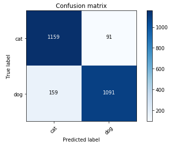

A few examples of positive classification can be seen in Figure 11 and Figure 12.

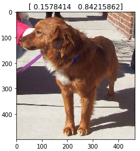

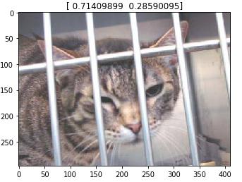

A few examples of erroneous classification can be seen in  Figure 13 and Figure 14. We can see that these are not particularly difficult examples.

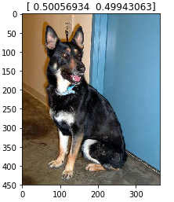

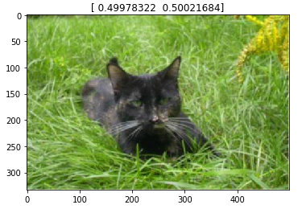


#### ResNet50 pre-trained results

This model was extremly successful with the new dataset. The results obtained evaluating the pre-trained ResNet50 model on the cats and dogs dataset are the following:

|   | LogLoss  | Accuracy  |
|---|---|---|
| Pretrained ResNet50  | 0.045  | 0.98  |

The confusion matrix can be seen in Figure 15. There are more errors classifying cats as dogs than dogs as cats.

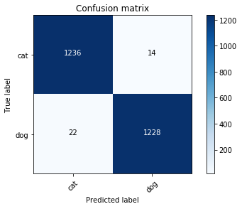

A few examples of positive classification can be seen in Figure 16 and Figure 17.

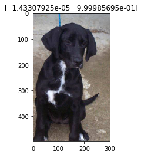

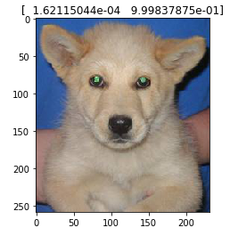

A few random examples of erroneous classification can be seen in Figure 18 and Figure 19. We can see that these are really difficult examples. Figure 18 shows a cat partially covered by a cage and Figure 19 show a dog partially covered by a person and with bad light conditions.

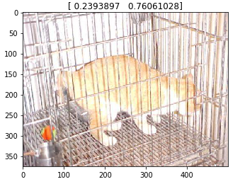

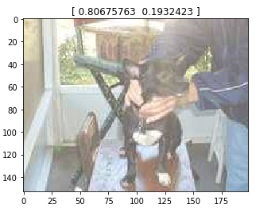


#### InceptionV3 pre-trained results

This model was extremly successful with the new dataset. The results obtained evaluation the pre-trained InceptionV3 model on the cats and dogs dataset are the following:

|   | LogLoss  | Accuracy  |
|---|---|---|
| Pretrained InceptionV3  | 0.046  | 0.97  |

The confusion matrix can be seen in Figure 20. There are more errors classifying cats as dogs than dogs as cats.

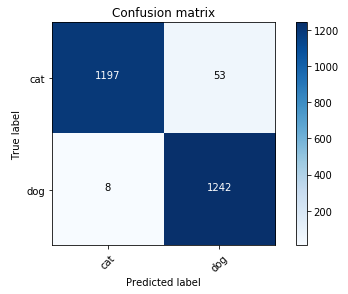

A few examples of positive classification can be seen in Figure 21 and Figure 22.

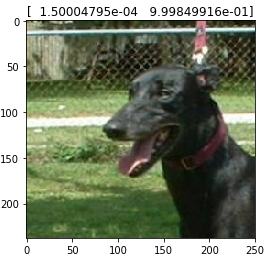

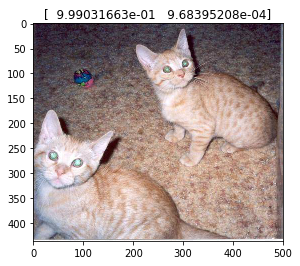

A few examples of erroneous classification can be seen in  Figure 23 and Figure 24. We can see that these a not particularly difficult examples.

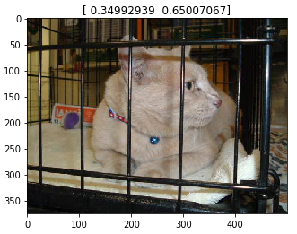

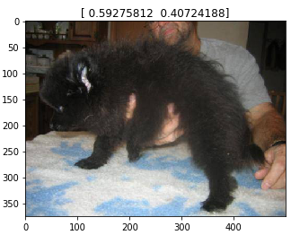


### Justification

We offer a comparison of the results obtained using the benchmark model and the pre-trained models. These results were obtained in a test dataset not seen  before by any of the model.

|   | LogLoss  | Accuracy  |
|---|---|---|
| Benchmark CNN  | 0.358  | 0.87  |
| Pretrained VGG16  | 0.335  | 0.9  |
| Pretrained ResNet50  | **0.045**  | **0.98**  |
| Pretrained InceptionV3  | **0.046**  | **0.97**  |

Althought the VGG16 pre-trained model offer an improve over the benchmark model, the pre-trained InceptionV3 and ResNet50 models show an improve by an order of magnitud. We have seen that the errors commited by these two models are really difficult images.


## V. Conclusion


### Reflection

In this capstone we have created and trained a model from scratch and used the predictions on the test dataset as a benchmark. Despite of being good results, best performance can be obtained using transfer learning. With regard with transfer learning, we have shown three pre-trained models, previously trained with ImageNet dataset. These pre-trained models were used to predict unseen data from the test dataset, it has been shown that the results are an order of magnitude better than the benchmark. The models that perform particularly better are InveptionV3 and ResNet50. The results indicate that the features extracted by the pre-trained convolutional neural networks are very powerful. This features can be used in another not previously seen dataset. 

It has been shown that using only a few lines of code we obtain better results than training a model from scratch. We shown that only 15 lines of code are required to implement a pre-trained model using the facilities offer by libraries like Keras. Transfer learning should be used as an easy way to obtain a benchmark to any new task, and improve from there.

In regard of the time of training, using a pre-trained model will take advantage of the hours of training done by the teams that create and trained the show models. This is an important point because the time and economics resource used in training the models can be leverage to new task.

One of the difficult aspects of this project was to manage a large amount of images in RAM, this can be hard deppending on the computer resources used.


### Improvement

The way the images are read and used in the project can be improved. The important aspects to be taken into account are the amount of memory used while reading and training. 

Another improvement proposed is to use more models in the comparison in future work. Using more models could give more insight into transfer learning.

Possibly, another dataset has to be used. The best models shown here did extremly well, so a more difficult dataset could be taken into account in future work.


## References

1. Olga Russakovsky*, Jia Deng*, Hao Su, Jonathan Krause, Sanjeev Satheesh, Sean Ma, Zhiheng Huang, Andrej Karpathy, Aditya Khosla, Michael Bernstein, Alexander C. Berg and Li Fei-Fei. (* = equal contribution) ImageNet Large Scale Visual Recognition Challenge. IJCV, 2015. https://arxiv.org/abs/1409.0575  
2. Christian Szegedy, Vincent Vanhoucke, Sergey Ioffe, Jonathon Shlens, Zbigniew Wojna. Rethinking the Inception Architecture for Computer Vision. 2015. https://arxiv.org/abs/1512.00567
3. Kaiming He, Xiangyu Zhang, Shaoqing Ren, Jian Sun. Deep Residual Learning for Image Recognition. 2015. https://arxiv.org/abs/1512.03385
4. https://angel.co/image-recognition
5. https://keras.io/
6. https://github.com/tensorflow/tensorflow
7. http://scs.ryerson.ca/~aharley/vis/fc/
8. https://arxiv.org/pdf/1409.1556v6.pdf